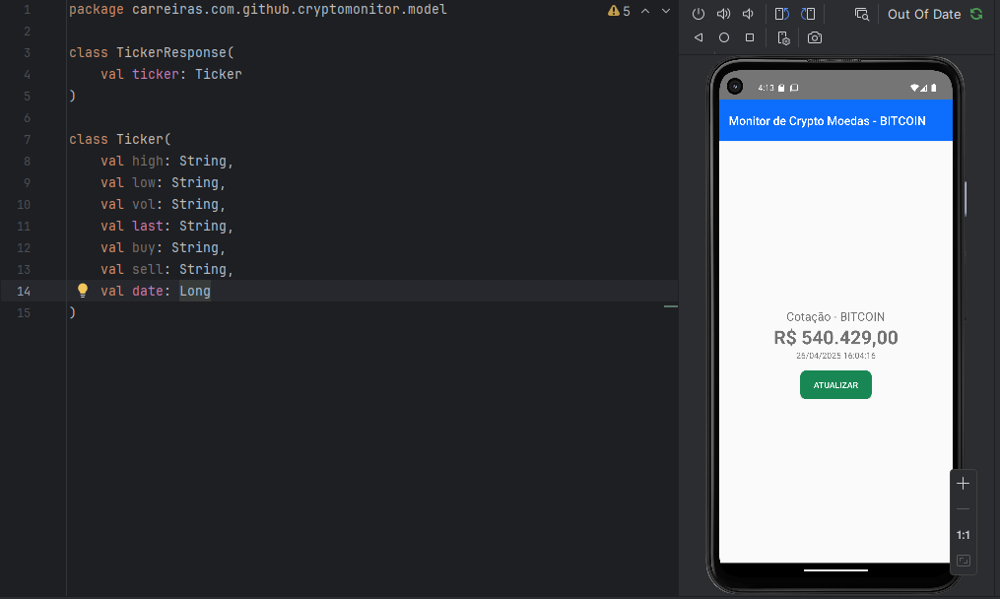
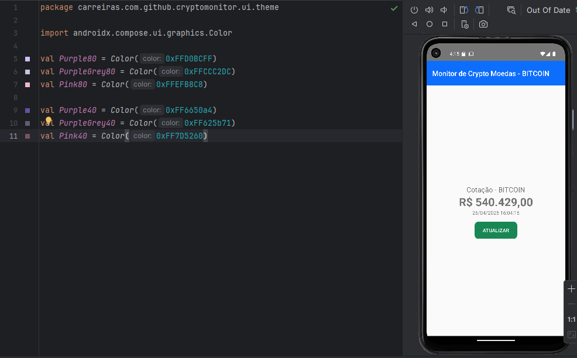
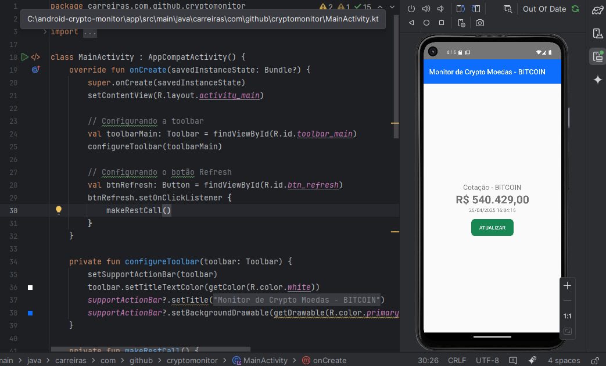
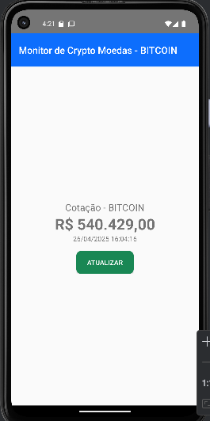

1-> Pacote model
Ele guarda a estrutura dos dados que recebe da API do Mercado Bitcoin:
TickerResponse-> Respresenta o retorno pela API.
Ticker: Onde contém informações como: preço,  volume e hora da ultima atualização.
//////////////////////////////////////////////////////////////////////////

2-> Pacote service
É responsável pela conexão com a internet (HTTP):
MarcadoBitcoinService: É a interface que define URL chamar usando o Retrofit(Biblioteca da API).
MercadoBitcoinServiceFactory: Cria uma instância configurada do Retrofit.

Em resumo o pacote chama a API para buscar o preço do Bitcoin.
/////////////////////////////////////////////////////////////////////////

3-> Pacote ui.theme:
São opcionais para o projeto funcionar, mas servem para deixar o app mais bonito:
Color.kt: Define cores que serão usadas no app.
Theme.kt: Aplica o tema claro ou escuro baseado no celular do usuário.
Type.kt: Define estilos de texto.
//////////////////////////////////////////////////////////////////////////

4-> Arquivo Principal do projeto: MainActivity.kt
Projeto:
-Configura a Toolbar(barra azul no topo)
-Botão "Refresh":
Quando clicado, chama makeRestCall(), ele faz uma requisição a API usando Retrofit.
No final ele atualiza o valor do bitcoin na tela:

